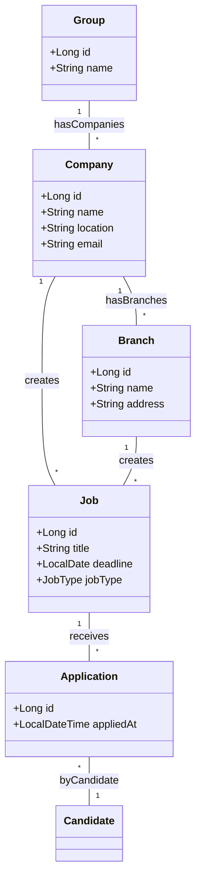
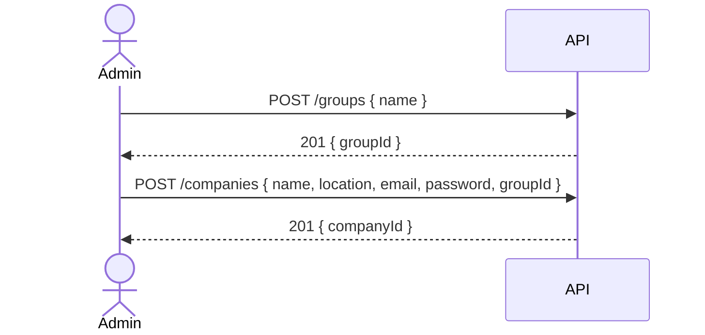

# Domain Model: Empresas e Grupos - VagaBounds

Este documento foca no **domínio de empresas** (companhias, filiais, grupos) e suas **relações** e **features**.

---

## 1. Entidades Principais

| Entidade        | Descrição                                                                         | Atributos-chave                                                          | Relacionamentos                                            |
| --------------- | --------------------------------------------------------------------------------- | ------------------------------------------------------------------------ | ---------------------------------------------------------- |
| **Group**       | Agrupamento de várias empresas/filiais pertencentes a um mesmo grupo corporativo. | id: Long name: String                                                | 1 Group → \* Companies                                     |
| **Company**     | Empresa ou filial cadastrada na plataforma, responsável por criar vagas.          | id: Long name: String location: String email: String ... | \* Company ↔ 1 Group 1 Company → \* Jobs               |
| **Branch**      | (Opcional) Subdivisão de `Company` para diferentes unidades físicas ou regionais. | id: Long name: String address: String                            | \* Branch → 1 Company                                      |
| **Job**         | Vaga de trabalho criada por uma empresa (ou filial).                              | id: Long title: String deadline: LocalDate jobType: Enum     | \* Job → 1 Company (ou Branch) 1 Job → \* Applications |
| **Application** | Candidatura de um candidato a uma `Job`.                                          | id: Long appliedAt: DateTime                                         | \* Application → 1 Job \* Application → 1 Candidate    |

---

## 2. Diagrama de Classes (Mermaid)

---

## 3. Fluxos Principais (Behavioral Models)

### 3.1 Cadastro de Empresa / Grupo

**Ator:** Administrador do Grupo
**Fluxo:**

1. *Request* cria **Group** (`/groups`).
2. *Response* retorna `groupId`.
3. *Request* cria **Company** com `groupId` no body (`/companies`).
4. *Response* confirma cadastro.

Sequence Diagram

### 3.2 Gestão de Filiais (Branches)

**Ator:** Company Manager
**Fluxo:**

* Criar filial: `POST /companies/{companyId}/branches` com dados de address e name.
* Listar filiais: `GET /companies/{companyId}/branches`.

### 3.3 Criação de Vagas por Filial ou Matriz

**Ator:** Company Manager / Branch Manager
**Fluxo:**

1. Se empresa usa filiais, seleciona `branchId`; senão, usa `companyId`.
2. Envia `POST /jobs` com `companyId` ou `branchId` no body.
3. API cria `Job` vinculado à entidade correta.

### 3.4 Relatório Consolidado de Vagas

**Ator:** Grupo Corporativo
**Fluxo:**

* `GET /reports/jobs?groupId={groupId}` → retorna total de vagas e candidaturas agregadas por empresa/filial.

---

## 4. Considerações de Padrões

* **CRUD** para `Group`, `Company`, `Branch`, `Job`, `Application`.
* **DTOs**: diretórios `dto/group`, `dto/company`, `dto/branch`.
* **Validações** com Jakarta Validation em todos os Requests.
* **Segurança**: rotas de `Group` e `Company` exigem `ROLE_COMPANY` ou `ROLE_ADMIN`.

---

> Esse modelo garante que você tenha uma visão clara das **empresas** como parte de **grupos** e **filiais**, facilitando relatórios centralizados e gestão delegada.
